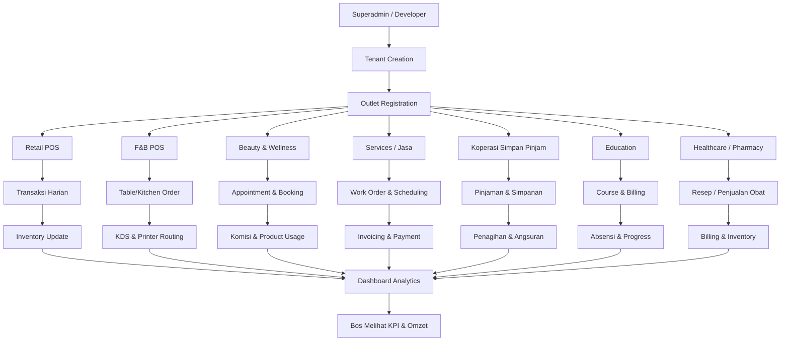

# 🚀 MULTI-INDUSTRY POS & BUSINESS MANAGEMENT PLATFORM
## Competing with Majoo, Moka, Qasir

---

## 🎯 TARGET INDUSTRIES

### 1️⃣ **FOOD & BEVERAGE (F&B)**
**Sub-sectors:**
- ☕ Coffee Shop / Cafe
- 🍜 Restaurant (Dine-in, Takeaway)
- 🍕 Fast Food / Quick Service
- 🍰 Bakery & Pastry
- 🧃 Bubble Tea / Juice Bar
- 🍱 Cloud Kitchen / Ghost Kitchen
- 🚚 Food Truck / Street Food

**Key Features Needed:**
- Table management & floor plan
- Kitchen display system (KDS)
- Order queue management
- Recipe & ingredient tracking
- Waste management
- Time-based pricing (happy hour)
- Integration dengan GoFood, GrabFood, ShopeeFood
- Split bill & tip management

---

### 2️⃣ **RETAIL**
**Sub-sectors:**
- 🏪 Minimarket / Convenience Store
- 👕 Fashion & Apparel
- 📱 Electronics & Gadgets
- 📚 Bookstore
- 🎮 Toy Store
- 🏡 Home & Living
- 🌿 Herbal & Health Products

**Key Features Needed:**
- Multi-variant products (size, color, etc)
- Barcode & SKU management
- Stock opname & inventory control
- Supplier management
- Purchase order (PO) system
- Consignment tracking
- Loyalty program & membership
- E-commerce integration (Tokopedia, Shopee, Lazada)

---

### 3️⃣ **BEAUTY & WELLNESS**
**Sub-sectors:**
- 💇 Salon & Barbershop
- 💅 Nail Studio
- 💆 Spa & Massage
- 🧖 Beauty Clinic
- 🏋️ Gym & Fitness Center
- 🧘 Yoga Studio

**Key Features Needed:**
- Appointment booking & scheduling
- Staff rostering & commission tracking
- Service packages & membership
- Treatment history & customer notes
- Before/after photo gallery
- Reminder notifications (WhatsApp, SMS)
- Therapist/stylist performance tracking

---

### 4️⃣ **SERVICES (JASA)**
**Sub-sectors:**
- 🚗 Car Wash & Detailing
- 🔧 Workshop & Repair
- 🧺 Laundry & Dry Cleaning
- 📸 Photography Studio
- 🖨️ Print & Copy Shop
- 🏠 Cleaning Services
- 🔌 Electrical/Plumbing Services

**Key Features Needed:**
- Job order management
- Service tracking & status updates
- Customer vehicle/item registration
- Warranty management
- Parts & material inventory
- Technician assignment
- Mobile app untuk field service

---

### 5️⃣ **KOPERASI & FINANCIAL SERVICES**
**Sub-sectors:**
- 🏦 Koperasi Simpan Pinjam
- 💰 Multi-purpose Cooperative
- 📊 Credit Union
- 🤝 Community Savings Group (Arisan)

**Key Features Needed:**
- Loan origination & approval workflow
- Installment calculation & collection
- Savings account management (wajib, sukarela, berjangka)
- Member registration (KTP verification)
- SHU calculation & distribution
- Financial reporting (RAT)
- Collateral management
- Overdue tracking & collection
- Integration dengan BI Checking

---

### 6️⃣ **EDUCATION (AKADEMIK)**
**Sub-sectors:**
- 🎓 Private School / Course
- 📖 Tutoring Center (Bimbel)
- 🎨 Art & Music School
- 💻 Coding Bootcamp
- 🌍 Language Course
- 🏫 Kindergarten / Daycare

**Key Features Needed:**
- Student enrollment & registration
- Class scheduling & attendance
- Fee management & installment
- Grade & report card
- Parent portal & communication
- Teacher management & payroll
- Certificate generation
- Online learning integration (Zoom, Google Meet)

---

### 7️⃣ **HOSPITALITY**
**Sub-sectors:**
- 🏨 Hotel & Guesthouse
- 🏠 Kost / Boarding House
- 🏕️ Villa & Resort
- 🎪 Event Space Rental

**Key Features Needed:**
- Room booking & availability
- Check-in / Check-out system
- Housekeeping management
- Channel manager (OTA integration: Booking.com, Agoda, Traveloka)
- Dynamic pricing
- Guest history & preferences
- Minibar & laundry tracking

---

### 8️⃣ **AUTOMOTIVE**
**Sub-sectors:**
- 🚗 Car Dealer / Showroom
- 🏍️ Motorcycle Dealer
- 🔧 Auto Repair / Bengkel
- 🛞 Tire & Spare Parts Shop

**Key Features Needed:**
- Vehicle inventory (VIN tracking)
- Test drive scheduling
- Service history tracking
- Parts catalog & compatibility
- Workshop job card
- Insurance & warranty management
- Trade-in valuation

---

### 9️⃣ **AGRICULTURE & LIVESTOCK**
**Sub-sectors:**
- 🌾 Agro Input Shop (Pupuk, Pestisida)
- 🐔 Poultry Farm
- 🐟 Fish Farm
- 🌱 Hydroponics

**Key Features Needed:**
- Batch & harvest tracking
- Feed & medicine inventory
- Growth monitoring
- Mortality tracking
- Distribution & logistics
- Government reporting (e-RDKK)

---

### 🔟 **HEALTHCARE**
**Sub-sectors:**
- 💊 Pharmacy / Apotik
- 🏥 Clinic / Puskesmas
- 🦷 Dental Clinic
- 👓 Optical Store
- 🩺 Medical Lab

**Key Features Needed:**
- Patient records (EMR)
- Prescription management
- BPJS integration
- Medicine expiry tracking
- Appointment scheduling
- Doctor schedule & consultation room
- Insurance claim processing

---

## 🏗️ CORE PLATFORM ARCHITECTURE

### **Modular System Design**

```
┌─────────────────────────────────────────────────────────┐
│           CORE PLATFORM (Base Subscription)              │
├─────────────────────────────────────────────────────────┤
│  • Multi-tenant Architecture                            │
│  • User & Role Management (RBAC)                        │
│  • Dashboard & Analytics                                │
│  • Basic POS (Cashier, Payment, Receipt)               │
│  • Product/Service Management                           │
│  • Customer Management (CRM Lite)                       │
│  • Basic Inventory                                      │
│  • Sales Report                                         │
│  • Multi-outlet Support                                 │
│  • Mobile App (Android & iOS)                          │
└─────────────────────────────────────────────────────────┘
                          ↓
┌─────────────────────────────────────────────────────────┐
│              INDUSTRY-SPECIFIC ADD-ONS                   │
├─────────────────────────────────────────────────────────┤
│                                                          │
│  📦 F&B Module                                          │
│     • Table management                                  │
│     • Kitchen Display System                           │
│     • Recipe management                                │
│     • Food delivery integration                        │
│                                                          │
│  📦 Appointment Module (Beauty, Healthcare, Service)   │
│     • Booking calendar                                 │
│     • Staff scheduling                                 │
│     • Reminder notifications                           │
│                                                          │
│  📦 Membership & Loyalty Module                        │
│     • Point system                                     │
│     • Tier management                                  │
│     • Reward redemption                                │
│                                                          │
│  📦 E-commerce Integration Module                      │
│     • Tokopedia, Shopee, Lazada sync                  │
│     • Order aggregation                                │
│     • Auto stock sync                                  │
│                                                          │
│  📦 Koperasi Module                                    │
│     • Loan management                                  │
│     • Savings account                                  │
│     • Member portal                                    │
│     • SHU calculation                                  │
│                                                          │
│  📦 Accounting & Finance Module                        │
│     • Double-entry bookkeeping                         │
│     • Tax calculation (PPh, PPN)                       │
│     • Financial statements                             │
│     • Budget planning                                  │
│                                                          │
│  📦 HR & Payroll Module                                │
│     • Employee database                                │
│     • Attendance (fingerprint, face recognition)       │
│     • Payroll calculation (BPJS, PPh21)               │
│     • Leave management                                 │
│                                                          │
│  📦 Advanced Inventory Module                          │
│     • Multi-warehouse                                  │
│     • Transfer stock                                   │
│     • Assembly/Disassembly                            │
│     • Batch & expiry tracking                         │
│                                                          │
│  📦 Marketing Automation Module                        │
│     • WhatsApp broadcast                               │
│     • Email marketing                                  │
│     • SMS campaign                                     │
│     • Customer segmentation                            │
│                                                          │
└─────────────────────────────────────────────────────────┘
```

---

## 💰 PRICING STRATEGY

### **Subscription Tiers**

#### 🥉 **STARTER** - Rp 99.000/bulan
- 1 Outlet
- 2 Users
- Basic POS
- Max 500 products
- 1000 transactions/bulan
- Basic reporting
- Mobile app
- Email support

#### 🥈 **BUSINESS** - Rp 299.000/bulan
- 3 Outlets
- 10 Users
- Full POS features
- Unlimited products
- Unlimited transactions
- Advanced reporting
- **1 Add-on module included**
- Inventory management
- Customer loyalty basic
- WhatsApp notification
- Priority support

#### 🥇 **PROFESSIONAL** - Rp 599.000/bulan
- 10 Outlets
- 30 Users
- **3 Add-on modules included**
- Multi-warehouse
- Advanced analytics
- API access
- Accounting integration
- Marketing automation
- Dedicated account manager

#### 💎 **ENTERPRISE** - Custom Pricing
- Unlimited outlets
- Unlimited users
- All modules included
- Custom features
- White-label option
- On-premise deployment
- 24/7 support
- Training & onboarding

### **Add-on Pricing**
- Each additional module: **Rp 50.000 - 150.000/bulan** (tergantung complexity)
- Additional outlet: **Rp 30.000/outlet/bulan**
- Additional user: **Rp 10.000/user/bulan**

---

## 🎯 GO-TO-MARKET STRATEGY

### **Phase 1: MVP (3-6 bulan)**
**Target:** F&B & Retail (paling banyak demand)
- Core POS system
- Basic inventory
- Simple reporting
- Mobile cashier app
- Payment gateway (QRIS, e-wallet)

**Target User:** 100 paying tenants

---

### **Phase 2: Expansion (6-12 bulan)**
**Add Industries:** Beauty & Wellness, Services
- Appointment module
- Membership system
- WhatsApp integration
- E-commerce integration (Tokopedia, Shopee)

**Target User:** 500 paying tenants

---

### **Phase 3: Vertical Expansion (12-24 bulan)**
**Add Industries:** Koperasi, Education, Healthcare
- Specialized modules
- Compliance features
- Government reporting
- Advanced analytics

**Target User:** 2000 paying tenants

---

### **Phase 4: Enterprise & Ecosystem (24+ bulan)**
- White-label solution
- API marketplace
- Third-party integration
- Developer platform
- International expansion

**Target User:** 10,000+ paying tenants

---

## 🔑 COMPETITIVE ADVANTAGES

### **Why Choose Us vs Majoo/Moka/Qasir:**

1. **🇮🇩 Truly Indonesian**
   - Understand local business culture
   - Support for arisan, koperasi, warung
   - Bahasa Indonesia first

2. **💪 Industry-Specific Features**
   - Not just generic POS
   - Deep features for each vertical
   - Built by talking to actual business owners

3. **💰 Flexible Pricing**
   - Start small, scale up
   - No long-term contract
   - Only pay for what you use

4. **🤝 Customer Success Focus**
   - Free onboarding & training
   - Local support team
   - Business consultation included

5. **🔌 Open Integration**
   - API-first architecture
   - Easy to integrate with existing tools
   - Marketplace for extensions

6. **📱 Mobile-First**
   - Work offline (important untuk daerah)
   - Lightweight & fast
   - Native Android & iOS

---

## 🚀 NEXT STEPS - YOUR CALL

**Pertanyaan krusial sekarang:**

1. **Target launch MVP kapan?** (3 bulan? 6 bulan?)

2. **Industry mana untuk MVP?** 
   - Rekomendasi saya: **F&B + Retail** dulu (paling banyak demand)

3. **Tim Anda sekarang?**
   - Solo atau ada developer lain?
   - Butuh designer?
   - Butuh backend developer?

4. **Backend sudah ada?**
   - Atau build from scratch?
   - Tech stack preference? (Node.js, Laravel, Go?)

5. **Budget untuk infrastructure?**
   - Cloud hosting (AWS, GCP, Azure?)
   - Payment gateway fee
   - WhatsApp Business API cost

6. **Target pricing?**
   - Mau compete by price atau by feature?
   - Freemium model atau trial only?

**Jawab ini, dan saya akan:**
✅ Create detailed technical blueprint
✅ Design database schema multi-industry
✅ Setup folder structure yang scalable
✅ Create reusable components library
✅ Build MVP roadmap dengan timeline

**Siap gas poll?** 🔥

# 🚀 Platform Bisnis Multi-Industri (Versi MVP)

## 🎯 Visi
Membangun **platform terpadu** untuk berbagai sektor usaha — dimulai dari:
- 🏪 Minimarket (Retail POS)
- 🏦 Koperasi Simpan Pinjam (KSP)

Platform ini berbasis **multi-tenant** (setiap UMKM = tenant sendiri)
dan dapat diperluas ke industri lain seperti F&B, Beauty, Jasa, Pendidikan, dan Kesehatan.

---

# 🚀 Platform Bisnis Multi-Industri (Blueprint)

## 🎯 Visi Utama
Membangun **platform terpadu** yang dapat digunakan oleh berbagai sektor usaha (multi-vertical SaaS).  
Fokus awal: **Minimarket (Retail POS)** dan **Koperasi Simpan Pinjam (KSP)**  
Tujuan jangka panjang: sistem dapat diperluas ke sektor **F&B, Beauty, Services, Education, Healthcare**, dan lainnya.

---

## 🧩 Arsitektur Sistem (Gambaran Umum)

```
+-------------------------------------------------------+
|                   PLATFORM CORE ENGINE                |
|-------------------------------------------------------|
| Auth & RBAC | Tenancy | Billing | Reports | AuditLog |
+-------------------------------------------------------+
        |           |           |           |
        v           v           v           v
+-----------------+  +----------------+  +----------------+
|  POS / Retail   |  | Koperasi (KSP) |  |   F&B / Others |
|  Transaksi, Stok|  | Pinjaman, SHU   |  | Table, KDS     |
+-----------------+  +----------------+  +----------------+
        |                         |
        +-----------+-------------+
                    |
              Supplier Portal
                    |
              Supply Chain Engine
                    |
              Analytics Dashboard
```

---

## ⚙️ Modul Utama Backend (NestJS Modular Monolith)

```
src/modules/
├── auth/          → Authentication & JWT
├── tenancy/       → Multi-tenant management
├── rbac/          → Role-Based Access Control
├── billing/       → Subscription & payments
├── pos/           → Retail POS
├── inventory/     → Stock management
├── supplier/      → Supplier portal & procurement
├── koperasi/      → Loan & savings (KSP)
├── accounting/    → General ledger & reports
├── reports/       → Analytics dashboards
└── audit/         → Logs & activity tracking
```

---


# 🚀 Platform Multi-Industri — Alur Ekspansi per Vertikal

Diagram ini memperlihatkan **alur operasional** yang sama untuk **banyak industri**, bukan hanya minimarket & koperasi.
Setiap vertikal bercabang setelah **Outlet Registration** lalu kembali ke **Dashboard Analytics**.

---



> Cabang industri bisa ditambah (Automotive, Hospitality, Agriculture) dengan pola yang sama.

---

## Ringkasannya
1. **Superadmin** membuat tenant → **Outlet** didaftarkan.  
2. Outlet memilih **paket industri** (Retail, F&B, Beauty, Services, Koperasi, Education, Healthcare, dll).  
3. Vertikal menjalankan **flow operasional spesifik**.  
4. Semua data kembali ke **Dashboard Analytics** yang sama sehingga manajemen bisa melihat KPI lintas-outlet & lintas-industri.

---

## 🧮 Struktur Peran dan Hak Akses (Role Hierarchy)

| Level | Role | Keterangan |
|--------|------|------------|
| Platform | Developer | Kelola sistem utama dan tenant |
| Platform | Superadmin | Pantau semua tenant & billing |
| Tenant | Owner | Pemilik UMKM / Koperasi |
| Tenant | Admin | Kelola outlet dan anggota |
| Tenant | Manager | Pantau transaksi outlet |
| Tenant | Cashier / Staff | Melakukan penjualan |
| External | Supplier | Akses portal supply chain |
| Customer | Member | Anggota koperasi / pelanggan retail |

---

## 🧱 Industri & Modul Vertikal

| Industri | Modul & Fitur Utama | Contoh Implementasi |
|-----------|----------------------|----------------------|
| 🏪 Retail | POS, Supplier Portal, Inventory | Minimarket / Toko UMKM |
| ☕ F&B | Table POS, Kitchen Display, Menu Management | Coffee Shop / Restoran |
| 💇 Beauty | Booking, Komisi, Produk | Salon, Klinik Kecantikan |
| 🔧 Services | Task Order, Invoice | Bengkel, Laundry, Jasa Servis |
| 🏦 Koperasi | Loan, Savings, SHU, OJK Report | KSP Kampus / Desa |
| 🎓 Education | Kursus, Pembayaran, Siswa | Sekolah, Bimbel, Bootcamp |
| 💊 Healthcare | Rekam Medis, Resep, Billing | Klinik, Apotek |

---

## 💰 Model Bisnis & Harga

| Paket | Harga (per Outlet/Bulan) | Fitur |
|--------|--------------------------|--------|
| Starter | Rp129.000 | POS Dasar, Laporan Harian |
| Business | Rp2 99.000 | POS + Inventory + Supplier Portal |
| Pro | Rp599.000 | Multi-outlet, Offline POS, Analytics |
| Enterprise | Custom | API, Private Server, SLA |
| Add-on | Mulai Rp99.000 | Koperasi, WhatsApp, Marketplace |

---

## 📈 Rencana Pengembangan (Roadmap)

| Fase | Target | Waktu |
|-------|---------|--------|
| Phase 1 | Retail + Koperasi MVP | 2 Bulan |
| Phase 2 | F&B Integration | 4 Bulan |
| Phase 3 | Beauty & Service | 6 Bulan |
| Phase 4 | Education & Healthcare | 9 Bulan |
| Phase 5 | ERP Integration & API Marketplace | 12 Bulan |

---

## 🧠 Kesimpulan untuk Manajemen
> Arsitektur modular ini memungkinkan sistem berkembang ke banyak sektor tanpa harus membuat ulang.  
> Fokus awal ke Retail dan Koperasi memastikan cashflow cepat, sambil menyiapkan infrastruktur untuk F&B, Beauty, dan sektor lain.

Platform ini = **“Satu Otak untuk Banyak Bisnis”**  
Sekali bangun core-nya, bisa dipakai selamanya.
