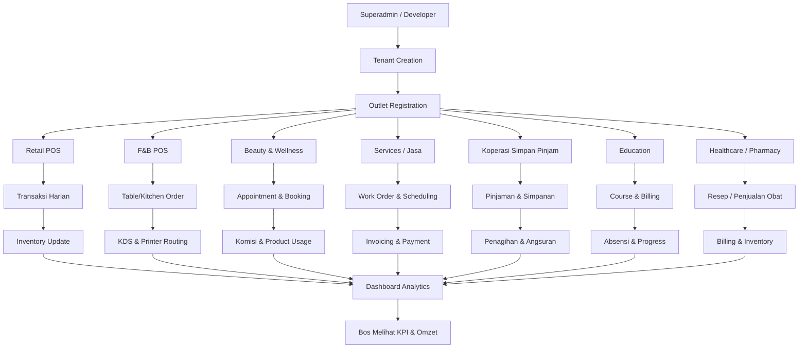

# Shadcn Admin Dashboard

Admin Dashboard UI crafted with Shadcn and Vite. Built with responsiveness and accessibility in mind.


I've been creating dashboard UIs at work and for my personal projects. I always wanted to make a reusable collection of dashboard UI for future projects; and here it is now. While I've created a few custom components, some of the code is directly adapted from ShadcnUI examples.

> This is not a starter project (template) though. I'll probably make one in the future.

## Features

- Light/dark mode
- Responsive
- Accessible
- With built-in Sidebar component
- Global search command
- 10+ pages
- Extra custom components
- RTL support

<details>
<summary>Customized Components (click to expand)</summary>

This project uses Shadcn UI components, but some have been slightly modified for better RTL (Right-to-Left) support and other improvements. These customized components differ from the original Shadcn UI versions.

If you want to update components using the Shadcn CLI (e.g., `npx shadcn@latest add <component>`), it's generally safe for non-customized components. For the listed customized ones, you may need to manually merge changes to preserve the project's modifications and avoid overwriting RTL support or other updates.

> If you don't require RTL support, you can safely update the 'RTL Updated Components' via the Shadcn CLI, as these changes are primarily for RTL compatibility. The 'Modified Components' may have other customizations to consider.

### Modified Components

- scroll-area
- sonner
- separator

### RTL Updated Components

- alert-dialog
- calendar
- command
- dialog
- dropdown-menu
- select
- table
- sheet
- sidebar
- switch

**Notes:**

- **Modified Components**: These have general updates, potentially including RTL adjustments.
- **RTL Updated Components**: These have specific changes for RTL language support (e.g., layout, positioning).
- For implementation details, check the source files in `src/components/ui/`.
- All other Shadcn UI components in the project are standard and can be safely updated via the CLI.

</details>

## Tech Stack

**UI:** [ShadcnUI](https://ui.shadcn.com) (TailwindCSS + RadixUI)

**Build Tool:** [Vite](https://vitejs.dev/)

**Routing:** [TanStack Router](https://tanstack.com/router/latest)

**Type Checking:** [TypeScript](https://www.typescriptlang.org/)

**Linting/Formatting:** [Eslint](https://eslint.org/) & [Prettier](https://prettier.io/)

**Icons:** [Lucide Icons](https://lucide.dev/icons/), [Tabler Icons](https://tabler.io/icons) (Brand icons only)

**Auth (partial):** [Clerk](https://go.clerk.com/GttUAaK)

## Run Locally

Clone the project

```bash
  git clone https://github.com/satnaing/shadcn-admin.git
```

Go to the project directory

```bash
  cd shadcn-admin
```

Install dependencies

```bash
  pnpm install
```

Start the server

```bash
  pnpm run dev
```

## Sponsoring this project ❤️

If you find this project helpful or use this in your own work, consider [sponsoring me](https://github.com/sponsors/satnaing) to support development and maintenance. You can [buy me a coffee](https://buymeacoffee.com/satnaing) as well. Don’t worry, every penny helps. Thank you! 🙏

For questions or sponsorship inquiries, feel free to reach out at [contact@satnaing.dev](mailto:contact@satnaing.dev).

### Current Sponsor

- [Clerk](https://go.clerk.com/GttUAaK) - for backing the implementation of Clerk in this project

## Author

Crafted with 🤍 by [@satnaing](https://github.com/satnaing)

## License

Licensed under the [MIT License](https://choosealicense.com/licenses/mit/)


# 🚀 Platform Multi-Industri — Alur Ekspansi per Vertikal

Diagram ini memperlihatkan **alur operasional** yang sama untuk **banyak industri**, bukan hanya minimarket & koperasi.
Setiap vertikal bercabang setelah **Outlet Registration** lalu kembali ke **Dashboard Analytics**.

---



> Cabang industri bisa ditambah (Automotive, Hospitality, Agriculture) dengan pola yang sama.

---

## Ringkasannya
1. **Superadmin** membuat tenant → **Outlet** didaftarkan.  
2. Outlet memilih **paket industri** (Retail, F&B, Beauty, Services, Koperasi, Education, Healthcare, dll).  
3. Vertikal menjalankan **flow operasional spesifik**.  
4. Semua data kembali ke **Dashboard Analytics** yang sama sehingga manajemen bisa melihat KPI lintas-outlet & lintas-industri.
